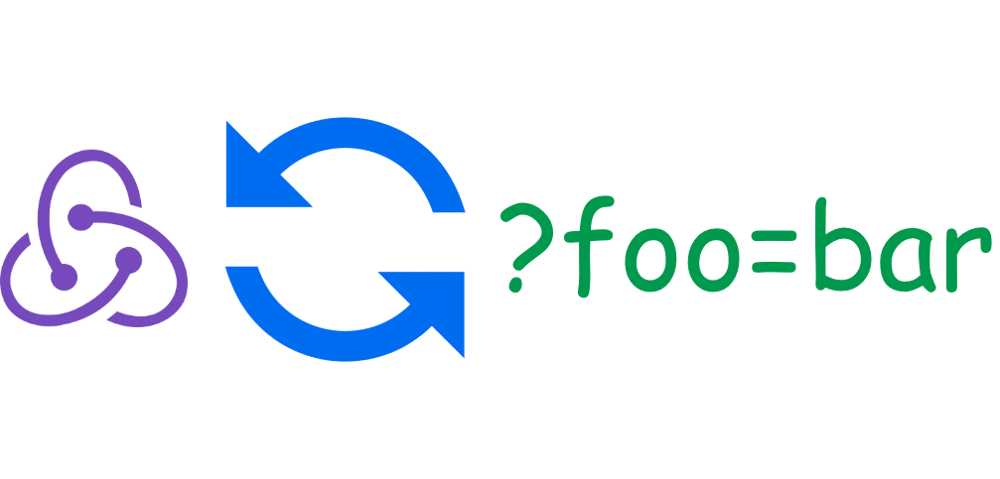

<div align="center">



[](https://github.com/teimurjan/sync-query-redux/blob/master/LICENSE.md)
[](https://www.npmjs.com/package/sync-query-redux)

[](https://travis-ci.org/teimurjan/sync-query-redux)
[](https://codecov.io/gh/teimurjan/sync-query-redux)

</div>

The library is created for easily synchronization between URL query params and redux state.
Inspired by [redux-query-sync](https://github.com/Treora/redux-query-sync).

## Installation

Installation can be done with [npm](https://www.npmjs.com/)

```sh
npm install --save sync-query-redux
```

or [yarn](https://yarnpkg.com/en/)

```sh
yarn add sync-query-redux
```

## Usage

### plain-sync

```javascript
import { plainSync } from "sync-query-redux";
import createHistory from "history/createBrowserHistory";

const history = createHistory();

const pathname = "/somePathname";
const actionCreator = newQueryString => ({
  type: "SOME_ACTION",
  newQueryString
});
const selector = state => state.queryString;
const options = {
  parseQuery: true,
  stringifyState: true,
  relyOn: "location",
  replaceState: true
};

const syncer = new plainSync.Syncer(pathname, actionCreator, selector, options);
const sync = new plainSync.Sync(store, history, syncer);
const stopSync = sync.start(); // use this function to stop synchronization
```

The core is `Syncer` object, which should be injected into `Sync`.

Working example can be found [here](./examples/plain-sync). You just need to run:

```sh
npm i
npm run start
```

or with yarn

```sh
yarn
yarn start
```

## API

#### Syncer

```javascript
type ActionCreator = (
  search: string | Object
) => { type: string, [key: string]: any };

type Selector = (state: Object) => any;

type Options = {
  parseQuery?: boolean,
  stringifyState?: boolean,
  replaceState?: boolean,
  relyOn?: "location" | "state"
};

interface ISyncer {
  constructor(
    pathname: string,
    actionCreator: ActionCreator,
    selector: Selector,
    options: ?Options
  ): void;
}
```

#### Sync

```javascript
import type { BrowserHistory as History } from "history/createBrowserHistory";
import type { Store } from "redux";
import Syncer from "./Syncer";

interface ISync {
  constructor(store: Store<any, any>, history: History, syncer: Syncer): void;
  start(): Function;
}
```

## Plans

- [x] Add tests
- [ ] Add module params-sync in which `Sync` will not have selector and actionCreator, but a list of params where each param will have its selector and its actionCreator.
- [ ] Make library available as a redux middleware

## Contributions

Contributors are welcome. Please discuss new features and submit PRs for bug fixes with tests.
Run `npm run build` which detects type errors, tests passing status and build the lib if everything is well.

## License

[MIT](./blob/master/LICENSE.md)
